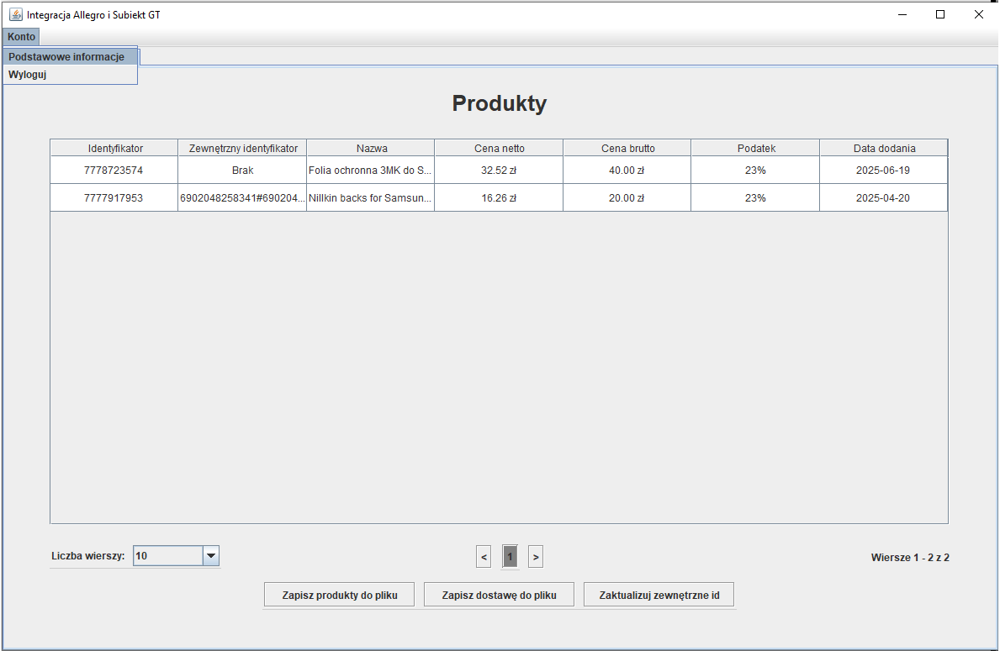
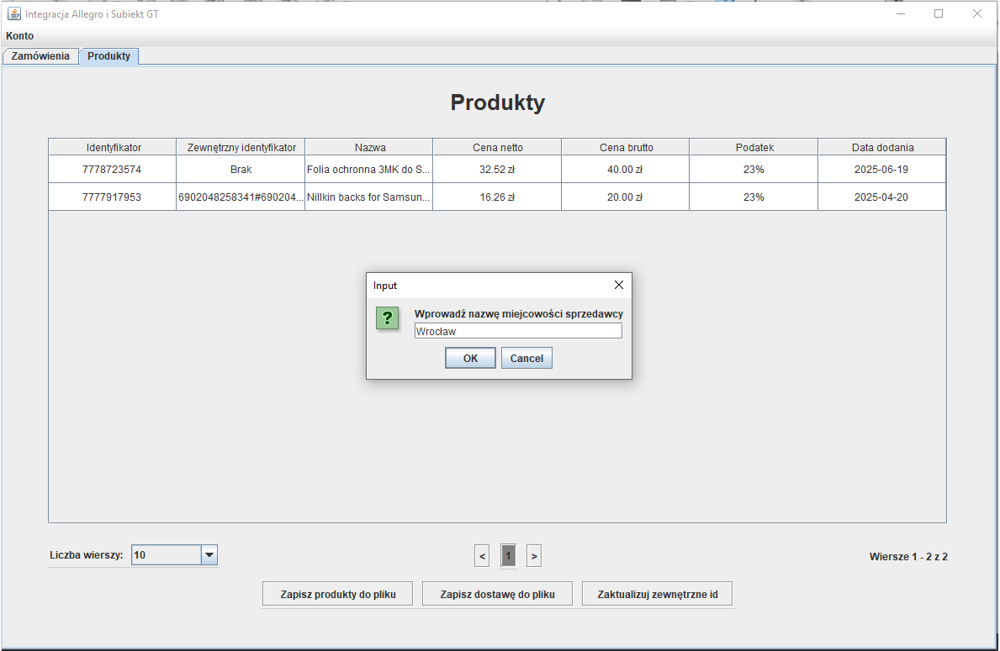
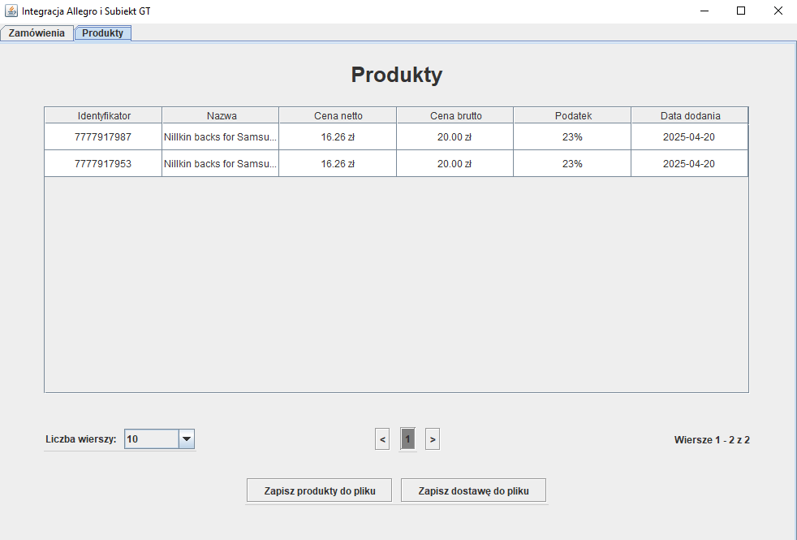
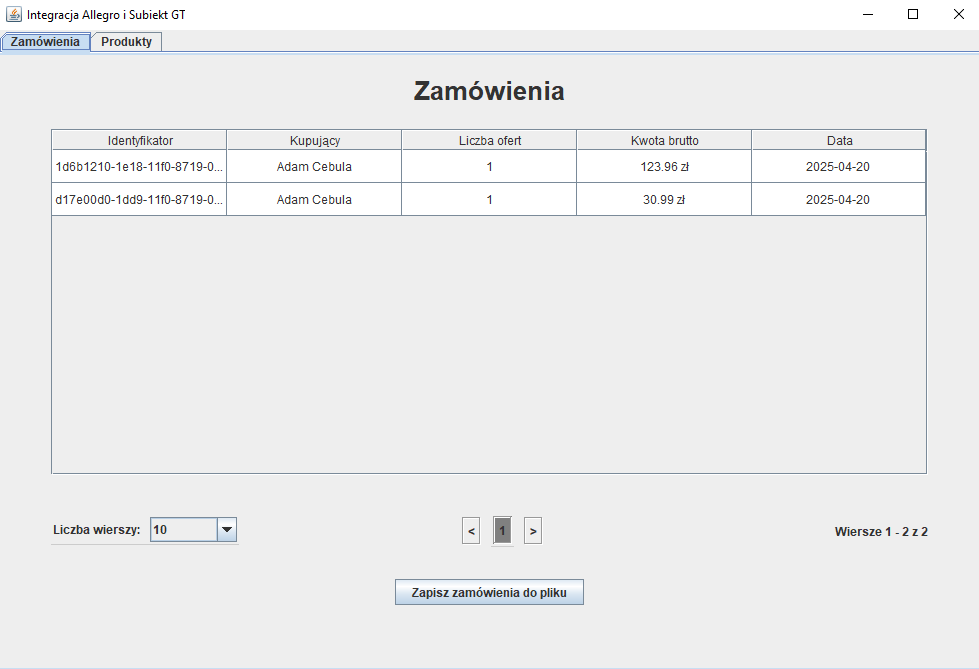
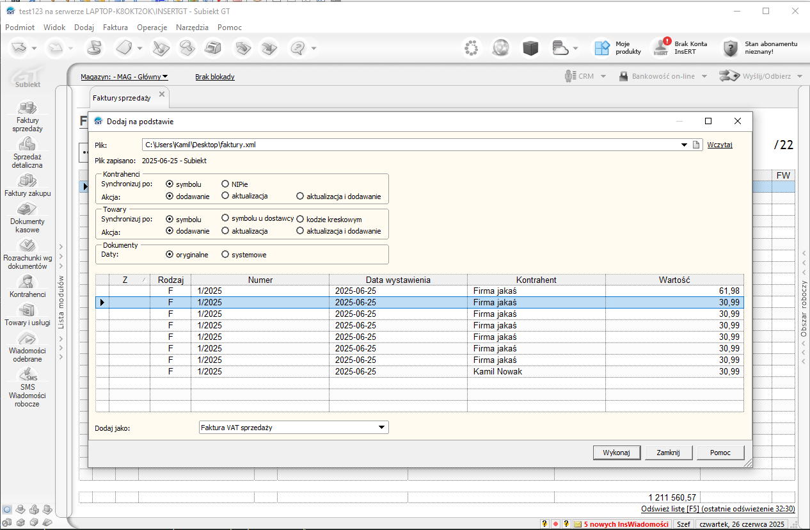
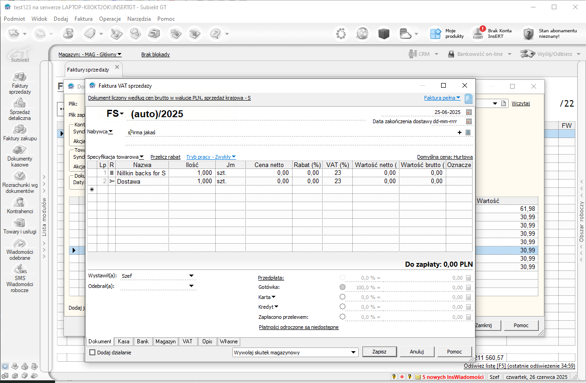
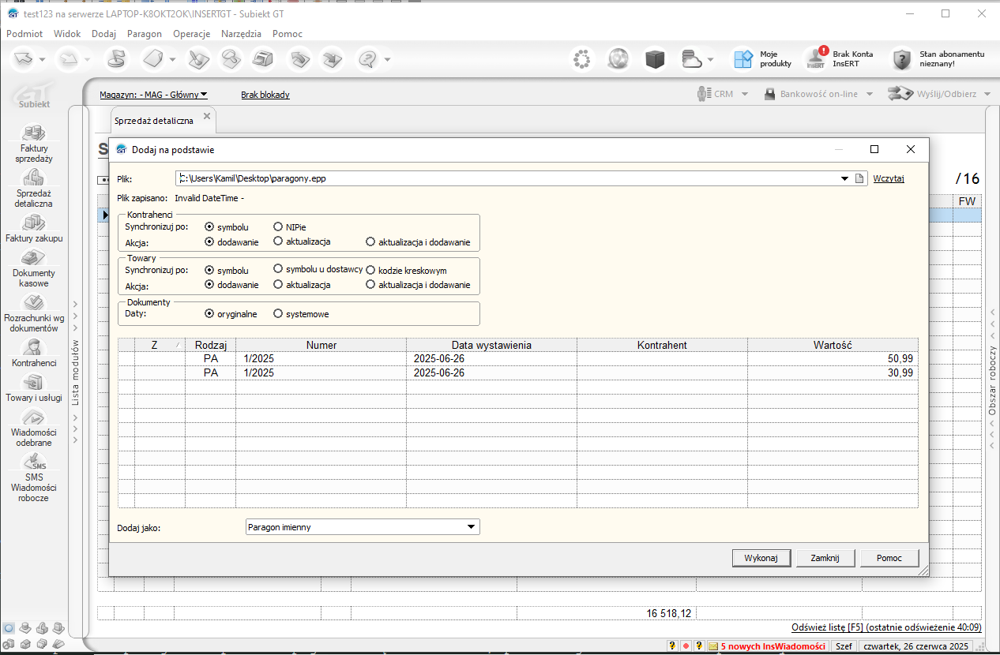
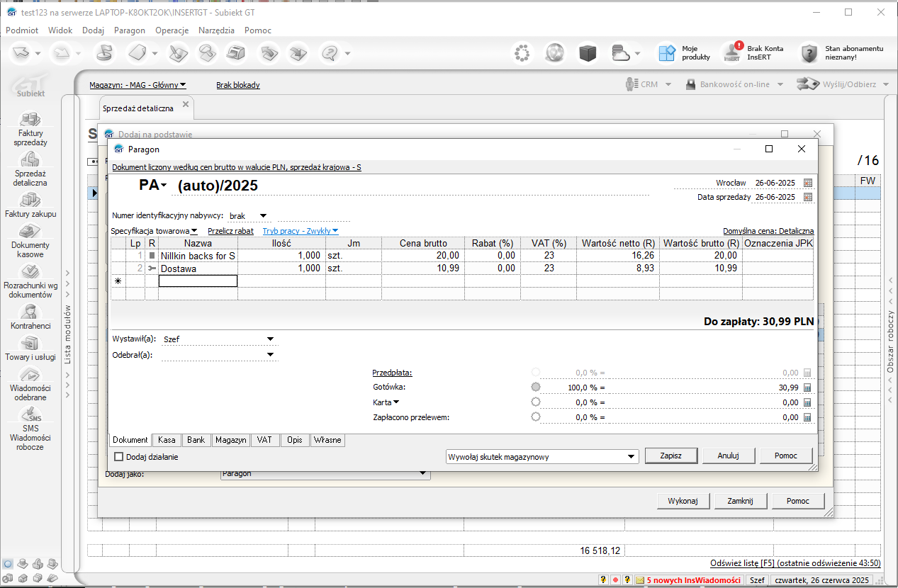
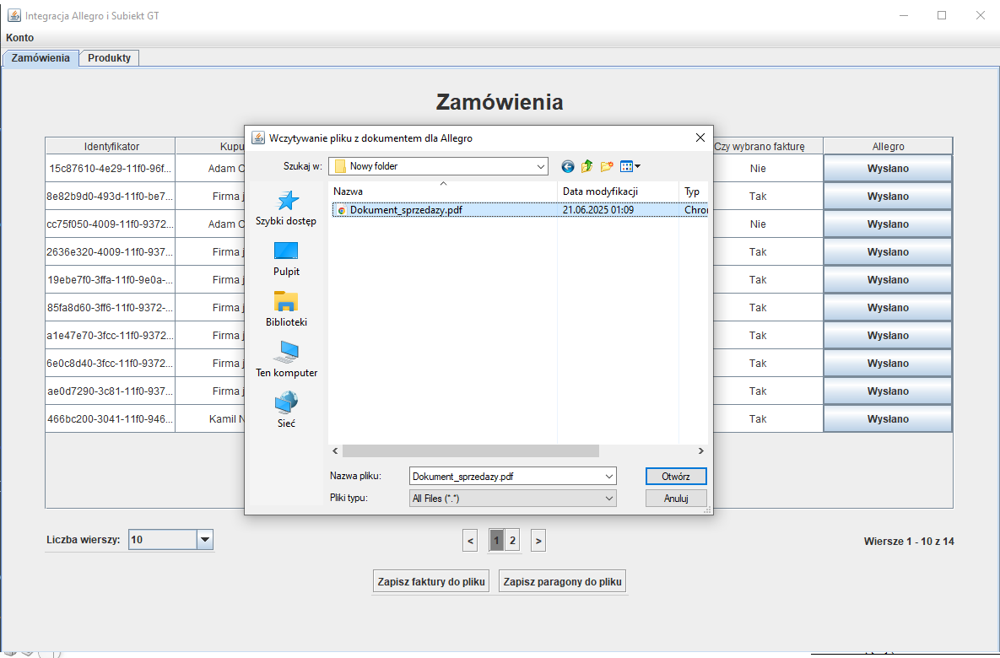

# Integracja Allegro i SubiektGT bez Sfery - zamówienia, faktury sprzedaży, paragony i produkty

Repozytorium dotyczy aplikacji desktopowej umożliwiającej prostą integrację Allegro z Subiekt GT. Integracja dotyczy zamówień po stronie Allegro oraz paragonów i faktur sprzedaży po stronie Subiekt GT oraz analogicznie ofert użytkownika - towarów. Ze względów bezpieczeństwa aplikacja ta operuje na środowisku testowym `Allegro Sandbox`, ale również mam wersję aplikacji przeznaczoną dla standardowego środowiska Allegro (produkcyjnego), jednak jest ona niepubliczna.
W razie potrzeby proszę napisać na mój adres e-mail kamdyw@wp.pl i chętnie przekażę wersję produkcyjną.

## Krótki opis działania aplikacji

Aplikacja łączy się z Allegro w imieniu konta Allegro posiadanego przez użytkownika aplikacji integrator. Jednak aplikacja będzie połączona z kontem z Allegro jedynie wtedy, gdy użytkownik na to zezwoli. Dodatkowo użytkownik będzie mógł się zapoznać z uprawnieniami, jakie uzyska aplikacja integrator.

Użytkownik może w aplikacji wybrać zakresy danych, które chce załadować do Subiekt GT. Następnie dane te zostaną zapisane w plikach o odpowiednich formatach akceptowanych przez Subiekt GT (.epp dla paragonów, towarów i usług oraz xml dla faktur sprzedaży). W Subiekt GT można następnie importować dane poprzez przykładowo skorzystanie z opcji `Operacje -> Dodaj na podstawie` po wcześniejszym przejściu do odpowiedniej sekcji np. z towarami.
Również możliwe jest z poziomu aplikacji dołączenie pliku z fakturą albo paragonem do danego zamówienia w Allegro.

Dane aplikacji potrzebne do połączenia z Allegro (`secret`) znajdują się w osobnym pliku i są zaszyfrowane dwukrotnie (w tym raz hasłem podawanym w aplikacji za pierwszym logowaniem) i po pierwszym uruchomieniu aplikacji są usuwane. Dane te bedą później przechowywane w menedżerze poświadczeń. Podobnie bedą przechowywane dane otrzymane po połączeniu z Allegro (`access token` i `refresh token`). Zaimplementowano odświeżanie tokenów dostępu po ich wygaśnięciu.

Aplikacja została w znacznej części przetestowana. Jednak najmniej przetestowane zostały sytuacje wyjątkowe np. gdy klientem jest ktoś z innego Państwa.

## Technologie

* Java,
* Swing,
* Maven,
* JSON,
* XML,
* REST,
* OAuth 2.0,
* Git.

## Krótki poradnik

Aplikacja powinna być pierwszy raz uruchomiona razem z plikiem `auth-data`. Po pierwszym zalogowaniu plik ten zostanie usunięty. Aplikacja jest napisana w Javie, zatem aby ją uruchomić potrzebne będzie zainstalowanie `Javy (JRE)`. Aplikację można uruchomić jak standardowy program na komputerze poprzez dwukrotne kliknięcie.

Po uruchomieniu aplikacji powinno się pojawić takie okno:

    

### Logowanie do aplikacji

Pierwszym krokiem jest logowanie do aplikacji:

    

Dla Allegro Sandbox hasłem jest `integracja-12234`.

Po zalogowaniu:

    

### Łączenie aplikacji z Allegro

Następnym krokiem jest połączenie aplikacji z Allegro:

    

Po naciśnięciu przycisku `ok` aplikacja przekieruje do strony Allegro. Konieczne jest posiadanie zalogowanego konta Allegro. 

Pierwszym krokiem jest potwierdzenie kodu z aplikacji. Jednak z powodu, że aplikacja automatycznie uzupełniła kod, wystarczy przejście dalej.

    

Następnie użytkownik może zapoznać się z uprawnieniami żądanymi przez aplikację integrator i zdecydować, czy warto zaufać tej aplikacji.

    

Po udanym procesie powinno wyświetlić się takie okno:

    

Ostatnim krokiem jest potwierdzenie zezwolenia uprawnień:

    

## Po zalogowaniu do aplikacji i połączeniu aplikacji z Allegro

Użytkownik może przeglądać swoje zamówienia lub oferty z Allegro oraz zdecydować, którą stronę z danymi chciałby załadować do Subiekt GT. Istotne jest, że aby poprawnie zaimportować paragony albo faktury sprzedaży w Subiekt GT, konieczne jest wcześniejsze istnienie w Subiekt GT towarów i usług, które zostały podane w tych dokumentach. Dodatkowo konieczne jest utworzenie usługi o nazwie dostawa, którą dostarcza aplikacja integrator, standardowo w postaci pliku.

### Miejsce wystawienia faktury

Dodatkowo polecam ustawić w aplikacji miejsce wystawienia faktury, aby wygenerowane w Subiekcie faktury nie miały pustego pola w miejscu wystawienia faktury. Aby tego dokonać, należy wejść w sekcję `Konto` i następnie wybrać z menu opcję `Podstawowe informajce`:

    

Następnym krokiem jest wpisanie odpowiedniego miejsca wystawienia faktury i zaakceptowanie okna:

    

### Wylogowanie

W razie chęci zmiany konta, jest możliwość wylogowania. Należy podobnie jak w przypadku miejsca wystawienia faktury wybrać menu `Konto` i kliknąć opcję `Wyloguj`.

## Towary

Zatem aby dodać faktury sprzedaży albo paragonów do Subiekt GT, pierwszym krokiem jest dodanie towarów:

    

Zapisywanie dostawy wygląda podobnie jak w przypadku innych produktów, jednak tutaj należy wybrać opcję `Zapisz dostawę do pliku` a nie `Zapisz produkty do pliku`.

Po naciśnięciu przycisku `Zapisz produkty do pliku` zostaną zapisane do pliku wszystkie produkty z danej strony. Po zapisaniu produktów w wybranej lokalizacji na dysku, następnym krokiem jest zaimportowanie ich do Subiekt GT. Proponuję zrobienie tego poprzez opcję `Dodaj na podstawie`:

    

Powinno pojawić się podobne okno:

    

Należy tak jak na powyższym screenie wybrać plik, nacisnąć `Wczytaj`, następnie zaznaczyć, które produkty mają być zapisane i potwierdzić poprzez `Wykonaj`.

W podobny sposób można dodać dostawę.

Faktury sprzedaży i paragony będą mogły być poprawnie zaimportowane do Subiekta tylko wtedy, gdy identyfikatory z Allegro albo zewnętrzne identyfikatory ofert będą takie same jak symbole produktów w Subiekcie. Oba parametry są podane w aplikacji Integracja dla wszystkich wczytanych ofert z Allegro.

Zewnętrzne identyfikatory ofert w Allegro mogą być ustawione poprzez wybranie opcji `Zaktualizuj zewnętrzne id`. Aplikacja ustawia jako zewnętrzne id kody producenta obecne w parametrach ofert. Zdecydowałem się na taki krok, gdyż gdy pobiera się zamówienia z Allegro, to przy produktach z ofert dotyczących tych zamówień podane są bodajże tylko identyfikatory i nie ma np. kodów producenta. Trzeba by było osobno dla każdego produktu z zamówienia pobierać dodatkowe informacje z Allegro, co pewnie spowolniłoby działanie aplikacji.

## Zamówienia

Po tych krokach powinno dać się już dodać kilka zamówień do Subiekta.

Przykładowy widok zamówień z Allegro:

    

W aplikacji można osobno zapisać paragony oraz faktury sprzedaży. Dodatkowo dla każdego zamówienia jest podane, czy klient wybrał fakturę, czy też nie. Oprócz tego podane jest, czy do danego zamówienia w Allegro został dołączony dokument potwierdzający sprzedaż.

Aby dodać zamówienia, polecam podobnie jak w przypadku towarów skorzystanie z opcji `Dodaj na podstawie`.

Jednak w tym przypadku Subiekt GT umożliwia wcześniejsze sprawdzenie wczytanych danych i dokonanie ewentualnych korekt.

Nie udało mi się zaimplementować tworzenia sumy kontrolnej, dlatego prawdopodobnie Subiekt GT będzie wysyłał ostrzeżenie odnośnie niezgodnej sumy kontrolnej.

Dodatkowo przy tworzeniu faktur sprzedaży konieczne jest podanie `Daty zakończenia dostawy` w Subiekcie ręcznie.

### Faktury sprzedaży

Zapisywanie faktur sprzedaży do pliku wygląda prawie tak samo jak dla produktów i jedyną różnicą jest format `.xml`, w przeciwieństwie do formatu `.epp` z produktów.

Po wczytaniu w Subiekcie pliku z fakturami powinno pojawić się takie okno:

    

Natępnie możliwe jest dodawanie do subiekta pojedynych faktur. Po wybraniu danej faktury i kliknięciu przycisku `Wczytaj` pojawi się standardowe okno z Subiekt GT do tworzenia faktury sprzedaży, lecz tym razem na szczęście wypełnione:

    

Można teraz ewentualnie skorygować wczytane dane i zapisać fakturę sprzedaży w Subiekcie.

### Paragony

Aplikacja Integracja umożliwia tworzenie jedynie zwykłych paragonów. Proces zapisu paragonów wygląda podobnie jak dla faktur sprzedaży, lecz tym razem paragony są zapisywane do formatu `.epp`.

Po wczytaniu w Subiekcie pliku z paragonami powinno pojawić się takie okno, podobne jak dla faktur sprzedaży:

    

Jednak tutaj polecam wybrać inną opcję `Dodaj na podstawie` niż domyślna `Paragon imienny`. Najbardziej odpowiednia będzie `Paragon`, która reprezentuje zwykłe paragony obsługiwane przez moją aplikację.

Bo wybraniu odpowiedniego paragonu i naciśnięciu opcji `Wczytaj`, pojawi się standardowe okno dla tworzenia paragonów zwykłych w Subiekcie, jednak tym razem wypełnione:

    

Podobnie zachęcam do sprawdzenia wczytanych danych i paragon będzie zapisany w Subiekcie po zatwierdzeniu.

### Wysłanie dokumentów sprzedaży do Allegro

Jak już wspomniałem, aplikacja Integracja umożliwia również zapisywanie dokumentów sprzedaży przy odpowiednich zamówieniach w Allegro. Do tego celu wystarczy kliknięcie przy danym zamówieniu z Allegro opcji `Wyślij fakturę` albo `Wyślij paragon`.

Później powinno pojawić się okno wyboru dokumentu sprzedaży z dysku:

    

Po zatwierdzeniu, wybrany dokument sprzedaży zostanie przypisany do wybranego zamówienia w Allegro.
